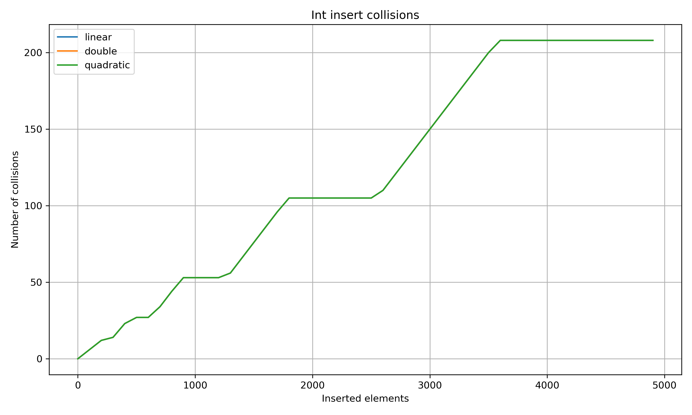
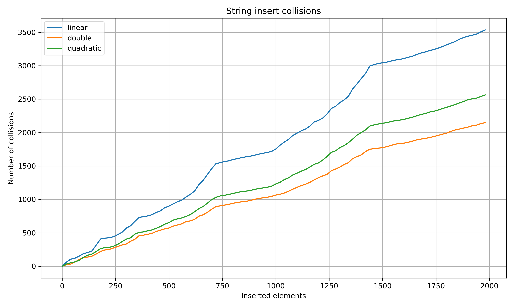
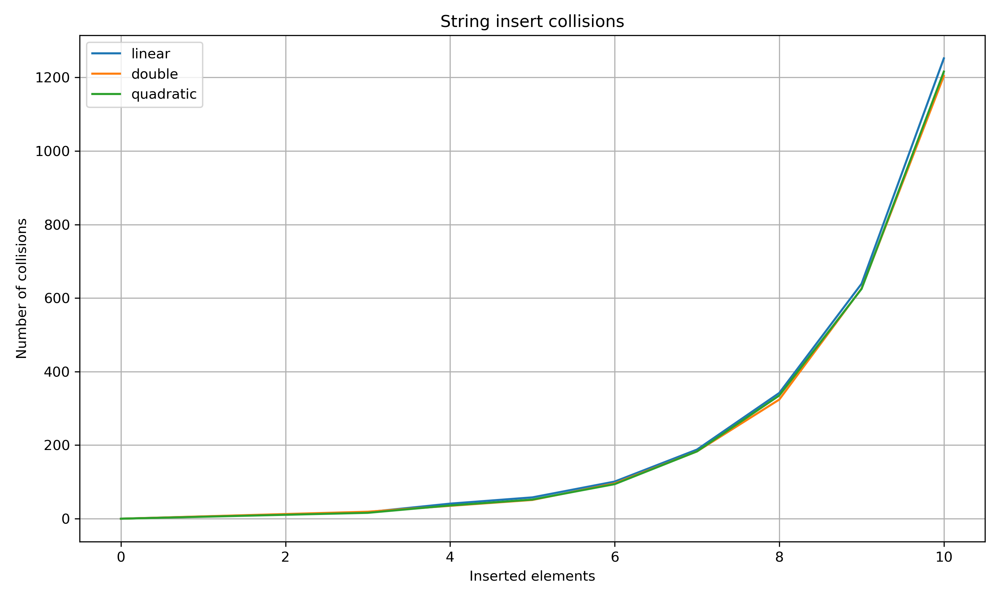

# 🗃️ Hash Table — Minimal Version v1.0

A minimal **C++ hash table** implementation using _open addressing_.  
This project was built **for educational purposes**, to deeply understand how hash tables work internally — including probing methods, load factors, and collision behavior.

This version provides the **core functionality** only.  
More experimental features and the full development history are available in the [`develop`](tree/develop) branch.

## 🧩 Overview

This project represents a **from-scratch implementation** of a hash table using **open addressing**.  
The goal was not to create a production-ready container, but to **understand every part of how hash tables work**  
from hashing functions and probing strategies to load factors and rehashing mechanics.

In addition to the core implementation, the project includes:
- **Unit tests** to verify correctness of insert, find, erase, and iterator functionality  
- Optional **statistic logging** for analyzing collisions and rehash behavior  

The project helped explore:
- How different probing methods handle collisions  
- How load factor and rehash frequency influence performance  
- Why certain key types (like strings) behave differently from numeric ones  
- What makes hash tables efficient in practice  

The result is a **clean, minimal implementation** with well-defined behavior and optional statistic logging for deeper analysis.  

> Essentially, this project is both a learning exercise and a small research experiment on hash table performance.

## 📊 Statistics

This project also includes a **collision and rehash analysis module**,  
used to study how different key types and probing strategies affect overall performance.

The experiments were conducted for two key types:

- `string` keys — high collision probability  
- `int` keys — nearly ideal hash distribution  

Each test measured:
- **Insert collisions** — total collisions during element insertion  
- **Rehash collisions** — collisions caused specifically during rehashing  
- **Rehash count** — number of times the table expanded  

---

### 🧮 Int Collisions Statistics

`int` is a simple numeric key type, which usually leads to **the smallest number of collisions**.  
Below is the result for **insert collisions** using all implemented probing strategies:



As expected, all three methods — **linear**, **quadratic**, and **double hashing** — perform **almost identically**.  
The collision rate is extremely low across all tests because integer keys are hashed into nearly unique indices.  

When it comes to **rehash collisions**, integers produced **zero collisions** for every probing type.  
This confirms that for well-distributed numeric keys, the choice of probing method has almost no impact on performance.

---

### 🔡 String Collisions Statistics

Unlike integers, `string` keys have a more complex structure and produce a **much higher collision rate**.  
Here’s the result for **insert collisions**:



From the graph, we can clearly see that **double hashing** performs the best with string keys,  
achieving the lowest total number of insert collisions compared to linear and quadratic probing.

Below is the second graph — **rehash collisions**:



This visualization shows collisions that occurred **only during rehashing** (table resizing).  
Because the hash table always expands to the **next power of two**, the growth pattern of collisions here  
closely follows an **exponential curve (~2ⁿ)**.  

Even though the number of rehashes remains constant, the **collision intensity increases** with each doubling of the table size.  

---

### 🧠 Summary

1. **Int keys**  
   - All probing strategies (linear, quadratic, double) behave identically.  
   - Collisions are almost nonexistent, confirming ideal key distribution.  
   - Rehash collisions are zero.

2. **String keys**  
   - Collisions are frequent, especially with linear probing.  
   - Double hashing consistently provides the best balance.  
   - Rehash collisions follow a **2ⁿ growth pattern**, reflecting the power-of-two table expansion.

> Together, these results confirm that collision frequency heavily depends on both the key type and the probing strategy used.

## 🔧 Language & Build

- **Language**: C++20  
- **Build System**: CMake  
- **Project Type**: Header-only library with optional test and statistics modules  

This project is structured to allow flexible builds for either **experiments** or **unit testing**.  

### 🧩 Build Options

| Option | Default | Description |
|:--------|:---------:|:-------------|
| `BUILD_TESTS` | `OFF` | Enables building of unit tests (from the `tests/` subdirectory). |
| `HASH_TABLE_STATISTIC` | `ON` | Builds the statistics executable used for collision analysis. |

--- 

### ⚙️ Example Build Commands
```bash
# Configure & build normally (with statistics)
mkdir build
cmake -S . -B build
cmake --build build

# Run statistics executable
./build/OpenHashTable

# Enable and build tests
cmake -S . -B build -DBUILD_TESTS=ON
cmake --build build
ctest --test-dir ./build/tests
```
You can switch between statistical builds and test builds using the provided CMake options,
making this project both a learning tool and a foundation for future hash table experiments.
